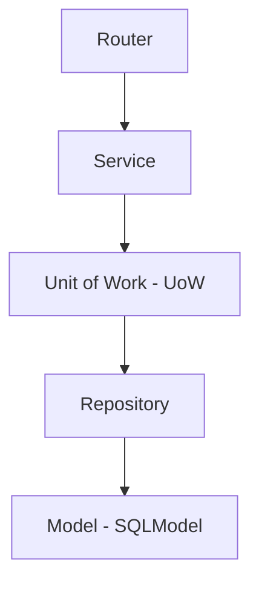

# Backend Skill: FastAPI & Python

Este skill define las reglas obligatorias para cualquier desarrollo en el backend del proyecto Food Store v5.0.

## 1. Arquitectura de Capas (Flujo de Dependencias)
El backend utiliza una arquitectura estricta por capas con **Flujo de Dependencias Unidireccional**. 
**Regla de Oro:** Ninguna capa puede importar de una capa superior.



- **Router (`router.py`)**: HTTP puro. Recibe petición, valida con Pydantic, delega al Service. NO contiene lógica de negocio.
- **Service (`service.py`)**: Lógica de negocio pura (stateless). Orquesta operaciones sobre los repositorios vía el UoW.
- **Unit of Work (`core/uow.py`)**: Gestiona la transacción. Provee acceso a repositorios y ejecuta `commit()` o `rollback()`.
- **Repository (`repository.py`)**: Acceso a BD. Hereda de `BaseRepository[T]`. 
- **Model (`model.py`)**: Tablas de SQLModel y relaciones.

## 2. Unit of Work (UoW)
Está prohibido inyectar sesiones (Session) directamente en los servicios o ejecutar `commit()`/`rollback()` manuales. 

**Flujo correcto:**
```python
with UnitOfWork() as uow:
    # 1. Leer datos
    producto = uow.productos.get_by_id(item.producto_id)
    # 2. Mutar
    uow.pedidos.create(nuevo_pedido)
    # 3. El commit se realiza automáticamente al salir del contexto (si no hay excepciones)
```
Si hay una excepción, el UoW realiza un `rollback()` atómico y automático.

## 3. Schemas Pydantic (Validación)
- Utiliza **Pydantic v2**.
- Mantén estricta separación de schemas por entidad: `Request/Create`, `Update`, y `Response/Read`.
- Nunca expongas un Model de SQLModel directamente en el Router (siempre usar `response_model` con Pydantic).

## 4. Autenticación y Autorización
- **JWT Dual**: Access token (30 min) y Refresh token (7 días, persistido en tabla `RefreshToken`).
- **RBAC**: Protege los endpoints usando la dependencia de roles: `@app.get("/", dependencies=[Depends(require_role(["ADMIN"]))])`
- Nunca almacenar contraseñas en plaintext. Usar `Passlib (bcrypt)` con factor de coste >= 12.

## 5. Diseño de API (RESTful)
- **Prefijo global**: Todos los endpoints deben colgar bajo `/api/v1`.
- **Errores**: Responde con el estándar RFC 7807 (Problem Details). `HTTPException` debe devolver JSON detallados.
- **Paginación**: Siempre implementa paginación (`skip`, `limit`) para endpoints que devuelvan listas (`GET /productos`, etc).
